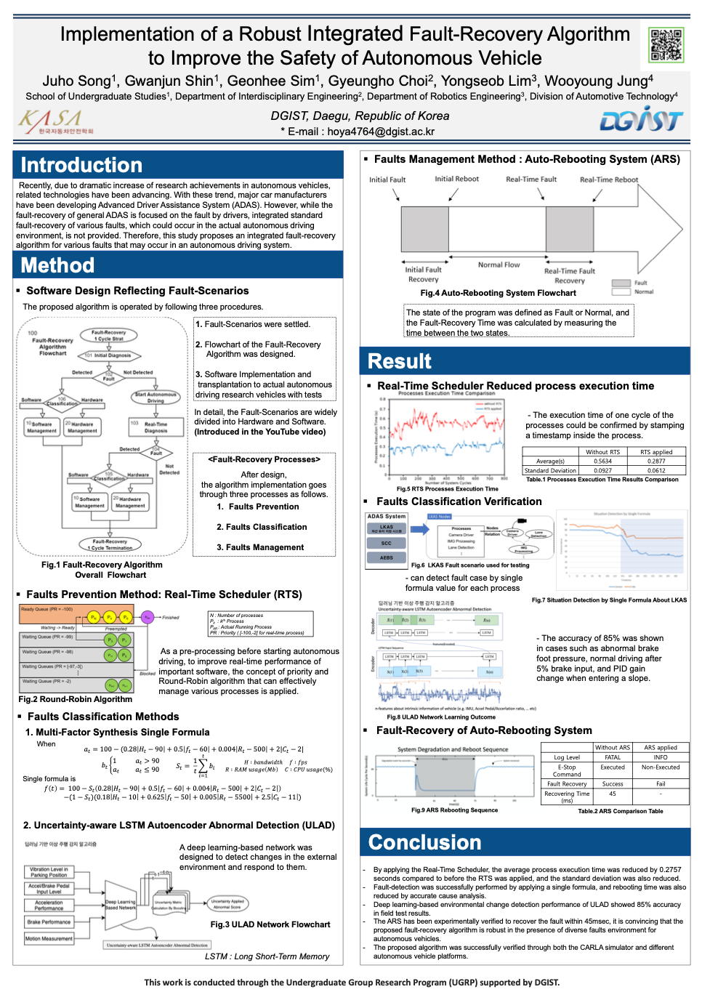
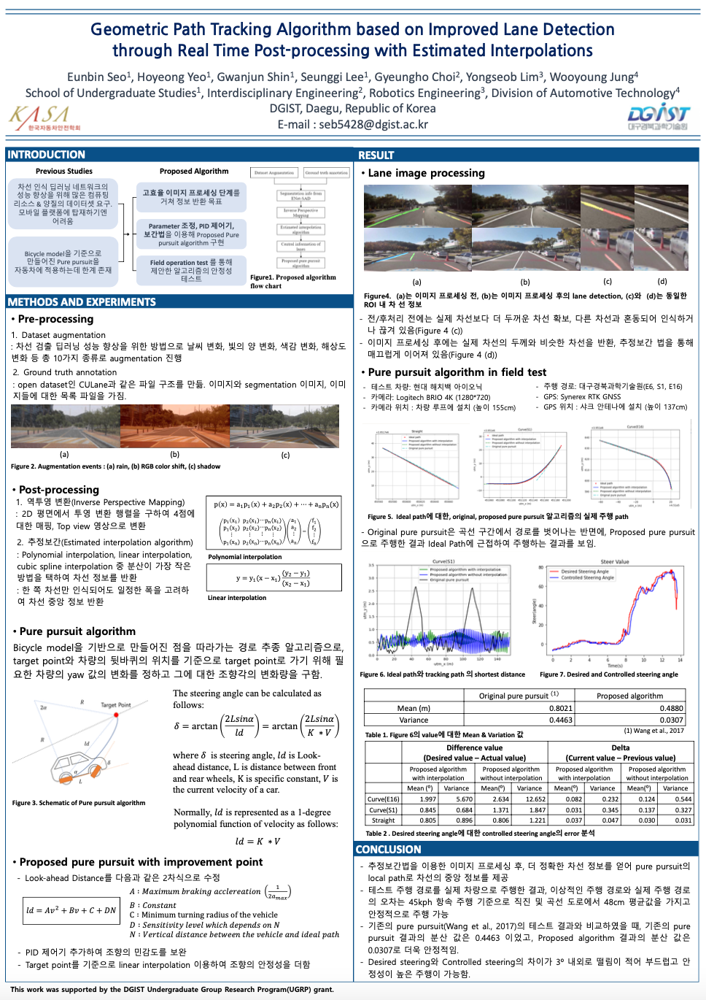

# Publication

## Reports
  1. KASA International Autonomous Vehicle Competition Technical Reports (PDF)   
      _2020 ARTIV Members_

  2. (AWARDED) KASA International Autonomous Vehicle Competition - Technical Excellence (Virtual Oral Presentation)

  <iframe width="560" height="315" src="https://www.youtube.com/embed/TB9S6XT2VhI" frameborder="0" allow="accelerometer; autoplay; clipboard-write; encrypted-media; gyroscope; picture-in-picture" allowfullscreen></iframe>

## Papers
  1. WIP

## Posters
  2020 KASA Conference Winter Session
  
  |Implementation of a Robust Integrated Fault-Recovery Algorithmto Improve the Safety of Autonomous Vehicle|Geometric Path Tracking Algorithm based on Improved Lane Detection through Real Time Post-processing with Estimated Interpolations|
|:---:|:---:|
|||
|Juho Song, Gwanjun Shin, Geonhee Sim, Gyeungho Choi, Yongseob Lim, Wooyoung Jung|Eunbin Seo, Hoyeong Yeo, Gwanjun Shin, Seunggi Lee, Gyeungho Choi, Yongseob Lim, Wooyoung Jung|

## Conference Oral
  1. (Virtual) 

